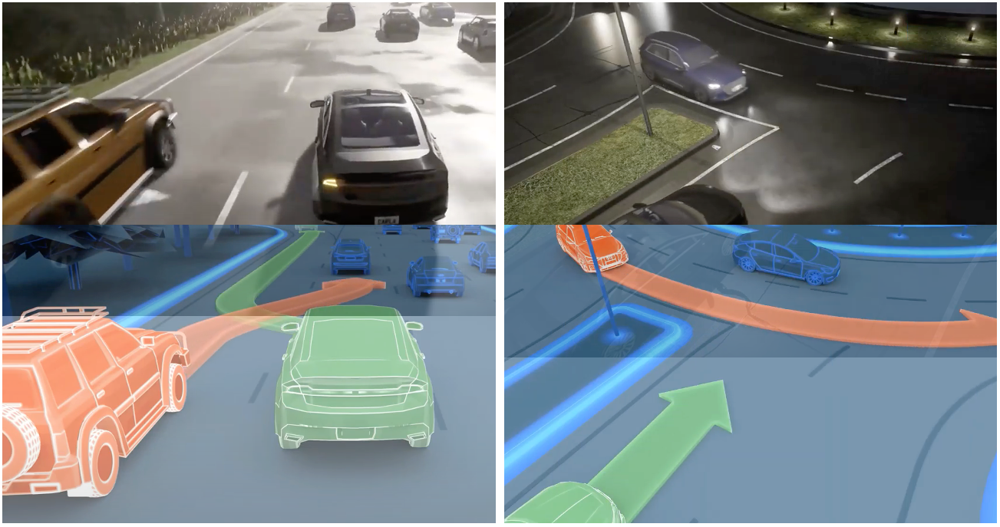

# MMFN: Multi-Modal Fusion Net for End-to-End Autonomous Driving

The whole dataset, model file ,and codes will be released after paper review, here is preview on `readme` in codes.

[](https://paperswithcode.com/sota/carla-map-leaderboard-on-carla?p=mmfn-multi-modal-fusion-net-for-end-to-end)

## Quickly view

Background: How to efficiently use high-level information or sensor data in end-to-end driving. To handle more scenarios as following figures (captures from CARLA leaderboard video)

<center>

</center>


The whole architecture in MMFN from origin paper [after reviewed]

Scripts quick view in `mmfn` folder:

- `phase0_collect.py` : collect data in select routes files or town map
- `phase1_preprocess.py` : pre-process data before training to speed up the whole training time
- `phase2_train.py`: after having training data, run this one to have model parameters files. (You can try training process on Docker also)
- `phase2_train_multipgpu.py` : use for DDP multi-GPU only to speed up training.
- `phase3_eval.py`: after having pre-trained or trained model from yourself, run this one to show the car's behavior on Carla leaderboard
- `phase4_replay.py` : using CARLA recorder to replay log file and analyses things

This repo also provide another experts with multi-road consideration.


## 0. Setup

Install anaconda
```Shell
wget https://repo.anaconda.com/archive/Anaconda3-2020.11-Linux-x86_64.sh
bash Anaconda3-2020.11-Linux-x86_64.sh
source ~/.profile
```

Clone the repo and build the environment

```Shell
git clone https://github.com/Kin-Zhang/mmfn
cd mmfn
conda create -n mmfn python=3.7
pip3 install -r requirements.txt
conda activate mmfn
```

If you already have CARLA 0.9.10.1, just ==skip this one==
Download and setup CARLA 0.9.10.1

```Shell
chmod +x mmfn/scripts/setup_carla.sh
./mmfn/scripts/setup_carla.sh
```

bashrc or zshrc setting:
```bash
# << Leaderboard setting
export USER_HOME=/home/kin
export CARLA_SUBMIT_FOLDER=${USER_HOME}/mmfn
export CARLA_ROOT=${USER_HOME}/carla
export SCENARIO_RUNNER_ROOT=${CARLA_SUBMIT_FOLDER}/scenario_runner
export LEADERBOARD_ROOT=${CARLA_SUBMIT_FOLDER}/leaderboard
export TEAM_ROOT=${CARLA_SUBMIT_FOLDER}/team_code
export PYTHONPATH="${CARLA_ROOT}/PythonAPI/carla/":"${SCENARIO_RUNNER_ROOT}":"${CARLA_SUBMIT_FOLDER}/":"${LEADERBOARD_ROOT}":"${CARLA_ROOT}/PythonAPI/carla/dist/carla-0.9.10-py3.7-linux-x86_64.egg":${PYTHONPATH}
```

## 1. Dataset

The data is generated with ```leaderboard/team_code/auto_pilot.py``` in 8 CARLA towns using the routes and scenarios files provided at ```leaderboard/data``` on CARLA 0.9.10.1

The dataset is structured as follows:

```
- TownX_{tiny,short,long}: corresponding to different towns and routes files
    - routes_X: contains data for an individual route
        - rgb_{front, left, right, rear}: multi-view camera images at 400x300 resolution
        - lidar: 3d point cloud in .npy format
        - measurements: contains ego-agent's position, velocity and other metadata
```

### Plan A: Download

TBD

### Plan B: Generation

First, please modify the config files and on `.zshrc` or `.bashrc` remember to export your `CARLA_ROOT`, If you want to use Town10HD, Please remember to download extra assets map from CARLA, like here:
```bash
cd path_to_carla
./ImportAssets.sh
```
```bash
absolute_path: '/home/kin/mmfn/'

scenarios: 'assets/all_towns_traffic_scenarios.json'
host: 'localhost'
port: 2000
trafficManagerPort: 0

# ============== for all route test =============== #
debug: True
towns: ['Town01', 'Town02', 'Town06', 'Town07']
routes: 'leaderboard/data/debug_routes/'

record: True
checkpoint: 'tmp.json'
start_id: -999
max_route_num: 999

# ====================== Agent ========================= #
track: 'MAP'
agent: 'agent_code/autoagents/mmfn/mmfn_pilot.py'
agent_config:
  if_save_data: True
  data_save: data/tmp
  debug_print: True
  pr_step: 10
```

Please write great port according to the CARLA server, and try to use Epic or vulkan mode since opengl mode will have black point on raining day

```bash
./CarlaUE4.sh -quality-level=Epic -world-port=2000
conda activate mmfn
python mmfn/phase1_collect.py
```

The dataset folder tree will like these one:

```bash
data
└── expert
    ├── Town02_01_09_00_12_27
        ├── lidar
        ├── maps
        ├── measurements
        ├── opendrive
        ├── rgb_front
        └── radar
    ├── Town02_01_09_00_23_08
    └── Town02_01_09_00_23_22

```


## 2. Training

No need CARLA in these phase, please remember to modify the train.yml config file and especially ==modify the DATA PATH==

The record and visulization on training params use the wandb, please login before train, more details can be found at [wandb.ai](wandb.ai), You can disable wandb from config file using `disabled`

### Docker

There is a Dockerfile ready for building training environment, but please remember to using `-v` link the datasets folder to container.


After building docker you can train directly with:

```bash
python mmfn/phase2_train.py
```

Or DDP if you want to use multi-GPU through DDP or multi computers: `nproc_per_node`  as using GPU，`nnodes` as computer number

```bash
CUDA_VISIBLE_DEVICES=0,1,2,3,4,5 python -m torch.distributed.launch --nproc_per_node=4 --nnodes=1 mmfn/phase2_train_multipgpu.py --batch_size 64 --epochs 201
```


### Benchmark

fork from transfuser codes, the benchmark training file and process can run as following command:

```bash
python agent_code/benchmark/aim/train.py --device 'cuda:0'
python agent_code/benchmark/cilrs/train.py --device 'cuda:0'
python agent_code/benchmark/transfuser/train.py --device 'cuda:0'
```


## 3. Evaluate

This part is for evaluating to result or leaderboard, you can also download the modal file and try upload to leaderbaord through leaderbaord branch.

1. Download or Train a model file saved to `log/mmfn`

2. Open carla

    ```bash
    ./scripts/launch_carla.sh 1 2000
    ```

3. Keep `config/eval.yaml` same as `collect.yaml` but modified model file location as first step side

    ```bash
    scenarios: "assets/all_towns_traffic_scenarios.json"
    track: 'MAP'
    agent: 'agent_code/teamagents/mmfn_agent.py'
    agent_config:
      model_path: 'log/expert_mmfn'
    ```
    
4. Running eval python script and see result json file in `result` Folder

    ```bash
    python mmfn/phase3_eval.py
    ```

## 4. Replay

If you want to look all the behavior on ego cars during evaluation, please set the record option on config file to True, and giving the correct reply path in `reply.yaml` :

```bash
python mmfn/phase4_replay.py time_factor=2.0 start=30.0
```

More detailed about CARLA Recorder can be found in this [link](https://carla.readthedocs.io/en/latest/adv_recorder/)

## Cite Us

```latex
@inproceedings{mmfnzhang,
  title={MMFN: Multi-Modal Fusion Net for End-to-End Autonomous Driving},
  author={Qingwen Zhang, Mingkai Tang, Ruoyu Geng, Feiyi Chen, Ren Xin, Lujia Wang},
  booktitle={2022 IEEE International Conference on Intelligent Robotics and Systems (IROS): In submission},
  year={2022},
  organization={IEEE}
}
```

## Acknowledgements

This implementation is based on code from several repositories. Please see our paper reference part to get more information on our reference

- [LBC](https://github.com/dotchen/LearningByCheating)
- [WorldOnRails](https://github.com/dotchen/WorldOnRails)

- [Transfuser](https://github.com/autonomousvision/transfuser)
- [2020_CARLA_challenge](https://github.com/bradyz/2020_CARLA_challenge)
- [CARLA Leaderboard](https://github.com/carla-simulator/leaderboard)
- [Scenario Runner](https://github.com/carla-simulator/scenario_runner)

